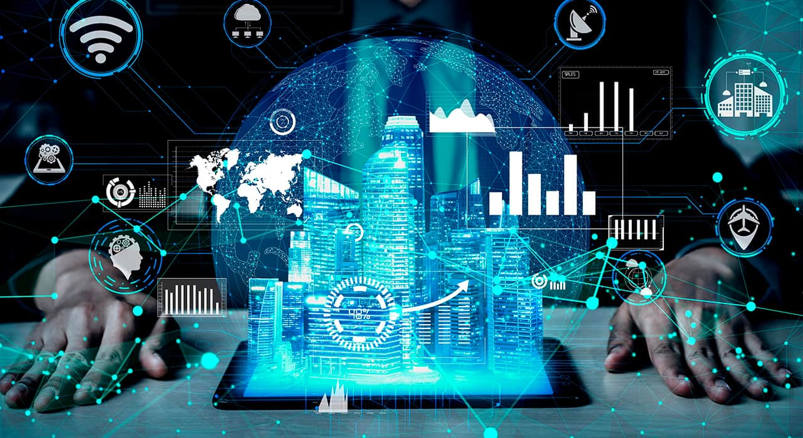
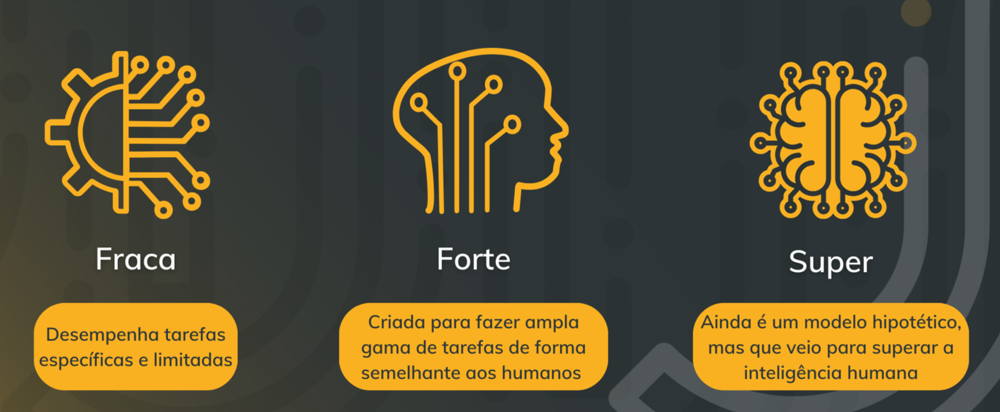
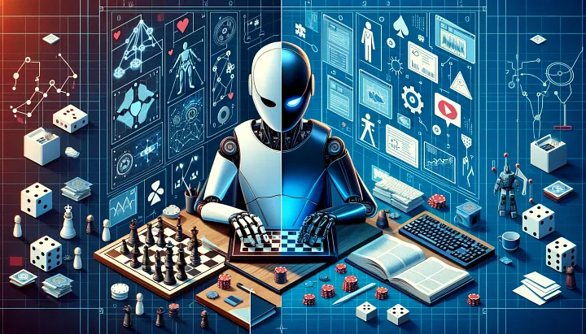

# Conceitos Básicos de IA: Definição e Sistemas Inteligentes

## Com quais IAs já interagimos?

## Por qual motivo estamos vendo IA nesse curso?

Percebemos como a tecnologia está mudando o mundo a uma velocidade incrível e a Inteligência Artificial está no centro dessa revolução. A IA já está presente em diversas áreas, como:
- **Saúde:** Diagnostica doenças com mais precisão e auxilia em tratamentos personalizados.
- **Educação:** Personaliza o aprendizado de cada aluno e oferece ferramentas de ensino inovadoras. Se bem usada, pode ser uma mentoria bastante rápida.
- **Negócios:** Automatiza tarefas, otimiza processos e permite tomar decisões mais estratégicas, que podem conter milhões de informações que uma pessoa apenas não seria capaz de ver (ou antever).
- **Finanças:** Detecta fraudes, analisa investimentos e oferece serviços financeiros personalizados.

Em breve, a IA estará presente em praticamente todos os setores, impactando diretamente o futuro do trabalho. **Dominar a IA significa ter um futuro profissional mais promissor**, com mais oportunidades e um papel ativo na construção desse novo mundo.

## O que é Inteligência Artificial?
    
**Definição:** 
A IA é a capacidade de um sistema de realizar tarefas que normalmente exigem inteligência humana, como aprender, resolver problemas e tomar decisões.
    
**Exemplos:** 
Reconhecimento de imagem, corretor automático, tradução automática, assistentes virtuais etc.
    
A Inteligência Artificial simula a inteligência humana, mas não a reproduz. Cada ser humano é distinto um do outro e possui livre arbítrio.

### Tipos de IA:

    
**IA Fraca (Narrow AI):** 
Sistemas projetados para tarefas específicas, já presente em diversos aspectos da vida, como jogos de xadrez, reconhecimento facial, assistentes virtuais, filtros de spam, recomendações de produtos.

**IA Forte (General AI):** Sistemas com inteligência comparável à humana, capazes de aprender e realizar diversas tarefas em diferentes domínios. Uma promessa hipotética, com desafios e impactos ainda não totalmente compreendidos (ainda em desenvolvimento).

**Super IA:** Um conceito ainda mais especulativo de Sistemas com inteligência superior à humana, redefinindo a própria natureza da inteligência (hipotético).

#### Comparação Entre IA Fraca, IA Forte e Super IA
    
**SEMELHANÇAS:**
***Baseadas em inteligência artificial:***
Todas as três são formas de inteligência artificial, buscando criar sistemas capazes de aprender, resolver problemas e tomar decisões.

***Uso de algoritmos e dados:***
Todas utilizam algoritmos e grandes conjuntos de dados para treinar e aprimorar suas capacidades.

***Potencial para impactar a sociedade:***
Todas têm o potencial de transformar diversas áreas da vida humana, impactando a economia, a cultura, a saúde e a forma como interagimos com o mundo.
    

**DIFERENÇAS**
|  Característica |                     IA Fraca |                   IA Forte |                 Super IA |
| --- | --- | --- | --- |
| **Capacidade** | Especializada em tarefas específicas | Multitarefa, com capacidade intelectual semelhante à humana | Transcende a inteligência humana em todos os aspectos |
| **Consciência** | Não possui | Possui autoconsciência, emoções e pensamento independente | Autoconsciente e autônoma, com capacidades avançadas de auto-reflexão |
| **Aprendizagem** | Dependente de dados e programação | Capacidade de aprendizado contínuo e adaptativo | Aprendizagem exponencial, com capacidade de transcender os limites humanos |
| **Objetivo** | Executar tarefas específicas com alta precisão | Alcançar inteligência equivalente ou superior à humana | Transcendência da inteligência humana, explorando o universo e a realidade de forma inédita |
| **Exemplos** | Assistentes virtuais, reconhecimento facial, motores de recomendação, carros autônomos | Hipotético | Hipotético |
| **Riscos** | Limitação a tarefas específicas | Possibilidade de perda de controle ou uso indevido | Riscos de descontrole, manipulação e impacto imprevisível na sociedade |
| **Estado atual** | Tecnologia existente e em constante desenvolvimento | Hipotético | Hipotético e especulativo |

## Um rápido olhar sobre Sistemas Inteligentes
A IA não é um monolito único, mas, sim, um conjunto de tecnologias e técnicas que permitem aos sistemas "pensar" e "agir" de forma inteligente.
    
### Tipos de Sistemas Inteligentes

|                   Área |                  Foco |               Técnicas |            Aplicações |
| --- | --- | --- | --- |
| **Aprendizado de Máquina (Machine Learning)** | Fazer computadores aprenderem a partir de dados, sem serem explicitamente programados. | Algoritmos de classificação, regressão, agrupamento, redução de dimensionalidade, árvores de decisão, etc. | Predição, detecção de fraudes, análise de risco, segmentação de clientes, recomendação de produtos, etc. |
| **Redes Neurais (Neural Networks)** | Inspirar-se no funcionamento do cérebro humano para criar sistemas de aprendizado profundo. | Redes neurais artificiais (RNAs), redes convolucionais (CNNs), redes recorrentes (RNNs), etc. | Reconhecimento de imagens e objetos, processamento de linguagem natural, tradução automática, reconhecimento de voz, geração de texto, etc. |
| **Processamento de Linguagem Natural (PNL)** | Permitir que computadores entendam e processem a linguagem humana. | Análise de texto, tokenização, stemming, lematização, análise de sentimento, extração de entidades, tradução automática, etc. | Chatbots, assistentes virtuais, tradução automática, análise de sentimentos em redes sociais, pesquisa de informação, etc. |
| **Visão Computacional** | Permitir que computadores "vejam" e interpretem imagens e vídeos. | Detecção de objetos, reconhecimento facial, rastreamento de movimento, segmentação de imagens, análise de imagens médicas, etc. | Carros autônomos, sistemas de segurança, robótica, diagnóstico médico, etc. |
    
## O que podemos concluir
A busca por uma IA mais avançada é contínua, com cada etapa trazendo novos desafios e oportunidades. O futuro da inteligência artificial está em constante transformação, e o debate sobre seus impactos e responsabilidades é crucial para garantir que o desenvolvimento da IA seja usado para o bem da humanidade.

## Para refletir
- Como a IA já impacta na minha vida?

## Dicas para se aprofundar

### Vídeos no YouTube em Português

- [Conceitos Básicos de Inteligência Artificial (IA)" - Engenharia Híbrida](https://www.youtube.com/@idelicaonline)
- [Inteligência Artificial EXPLICADA de maneira SIMPLES em APENAS 20 minutos - pela Diolinux](https://www.youtube.com/watch?v=_iPnUxfvUyY)

### Outros links
- [Inteligência artificial" - Brasil Escola](https://brasilescola.uol.com.br/informatica/inteligencia-artificial.htm)
- [O que é inteligência artificial (IA)?" - IBM](https://www.ibm.com/br-pt/topics/artificial-intelligence)
- [O que é IA? Saiba mais sobre inteligência artificial" - Oracle](https://www.oracle.com/br/artificial-intelligence/what-is-ai/)
